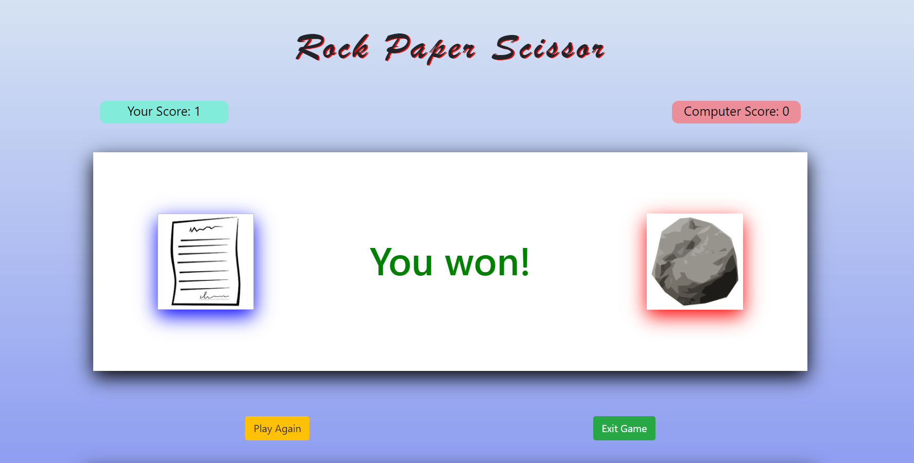
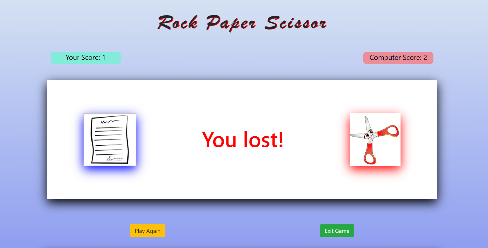

# RockPaperScissor-Game
#### A Rock Paper Scissor game for the user(Human) to play as Player1 with Computer(Bot) as Player 2
 
### About:

Play the original rock paper scissor game online. Go up against our
        computer robot and decide rock, paper or scissors. Rock, paper, &
        scissor is a classic game that has been around for decades. You can
        entertain yourself virtually for hours with this game. It's also helpful
        for making important descions based upon the outcome of winning or
        losing each game.
        
        
`User clicks on a choice and result is displayed as
You lost or 
You won or 
Tie`

`Also, maintains score of Computer and User`

`User's choice is displayed on Left and Computer's Choice is displayed on right`

`Then, user gets option to PLAY AGAIN or EXIT GAME`

---

## Logic of Game: 

+ Rock beats scissor

+ Paper beats rock

+ Scissor beats paper

---

## Features:

+ Responsive
+ Maintains score of Computer and User
+ Accessible
+ Has animations and sound effects
---

---

### On choosing one of the three: 

#### Result displayed:

 
---

### Tech Stack: 

-HTML5

-CSS3

-JavaScript (majorly) 

-Bootstrap4

